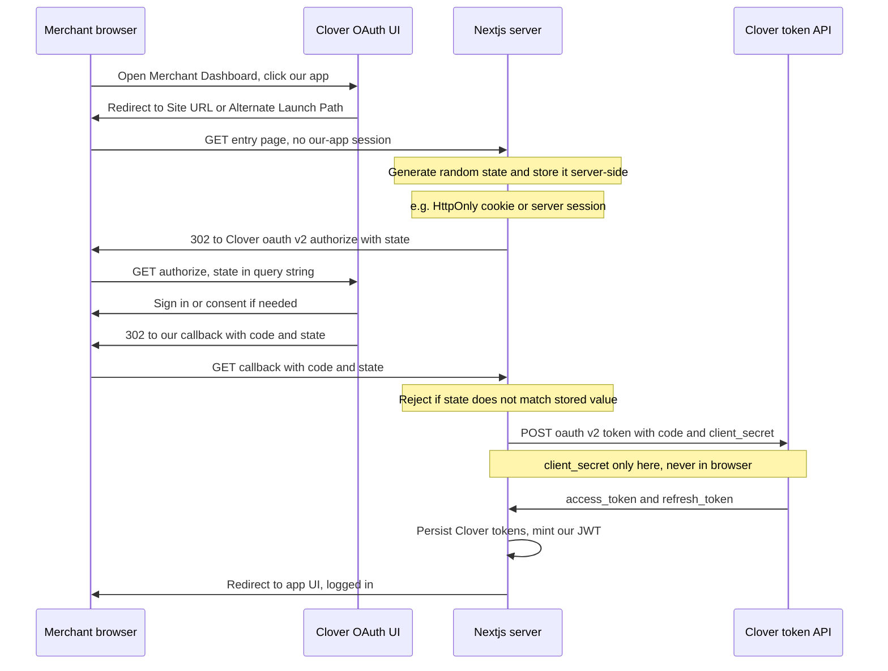

# cl-reporter

Custom Report App for Clover Marketplace.

**Docs:** Product intent lives in [`docs/PRD.md`](docs/PRD.md). **Glossary + DB schema (v1 spec):** [`docs/data-model.md`](docs/data-model.md). **Architecture (Kind/K8s, services, infra choices):** [`docs/architecture-v1.md`](docs/architecture-v1.md). Agent and contributor workflow is in [`AGENTS.md`](AGENTS.md). **Clover dashboard + local OAuth setup:** [`docs/clover-developer-setup.md`](docs/clover-developer-setup.md). **Full auth narrative:** [`docs/authorization-flow.md`](docs/authorization-flow.md).

## Authorization flow (Merchant Dashboard launch)

When a merchant opens the app from the **Clover Merchant Dashboard**, our **server** starts OAuth: it puts **`state`** on the authorize redirect and later checks it on the callback. **`client_secret`** is used **only** on the **token** request from the server to Clover (never in the browser). Details and tables: [`docs/authorization-flow.md`](docs/authorization-flow.md) (section **§3.1**).

</think>

<｜tool▁calls▁begin｜><｜tool▁call▁begin｜>
StrReplace