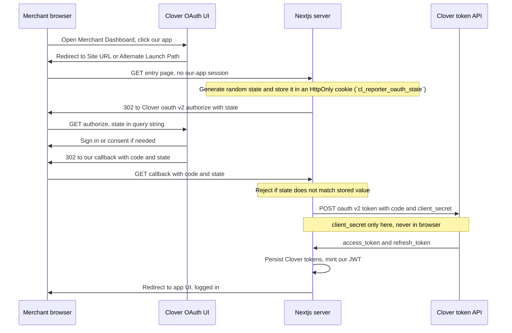

# Authorization flow — cl-reporter

How merchants get into the app, how we stay authorized to call Clover, and how we **reduce lockouts and “sync” confusion** as much as **our** software can. This complements **`docs/PRD.md`** §6 and §7.

---

## 1. Principles (non-negotiable)

1. **We do not use Clover’s Merchant Dashboard session cookie on our domain.** Clover runs on **their** origins; our app runs on **ours**. Browser security prevents relying on their session for `ourapp.com`.
2. **Clover OAuth tokens** (`access_token`, `refresh_token`) exist so our **servers** can call **Clover REST APIs**. They are **not** a substitute for **our** logged-in user experience; we store them **encrypted** and refresh them **server-side**.
3. **Our app session** (first-party): after OAuth succeeds, we establish **our own** session for the merchant on **our** domain. **V1 default:** **JWT** (see **§6.1**) — **access JWT** proves identity to our APIs; **not** an opaque session id in a cookie. That session only means “this browser is allowed to use cl-reporter as this tenant.”
4. **Reconnect Clover** is a **normal** path when the **refresh token** chain dies — not an exceptional edge case. Product copy and engineering should treat it that way.

---

## 2. Things that must not be confused

| Concept | What it is |
|--------|------------|
| **Clover developer login** | Logs you into **Global Developer Dashboard** (build apps, sandbox). **Not** the merchant using our app in production. |
| **Sandbox test merchant** | A fake business used to test installs and OAuth. Credentials are **merchant-side**, separate from developer account, in normal testing setups. |
| **App `client_id` / `client_secret`** | Identify **our app** to Clover. Live in **env / secrets** — **one** pair per environment — **not** per merchant in the database. |
| **Merchant `merchant_id` + OAuth tokens** | Identify **one subscribed business** and authorize API calls. **Per merchant** rows in **our** DB. |

Mixing **developer** URLs, **merchant** URLs, or **which account** you’re logging into is a major source of “lockouts” in dev — see §8.

---

## 3. Happy path — merchant opens app from Clover (App Market / Dashboard)

1. Merchant is logged into **Clover** (dashboard / app list) and clicks **our** app.
2. Clover redirects the browser to our **Site URL** (and **Alternate Launch Path** when applicable) with OAuth parameters (e.g. **`merchantId`**, **`employee_id`**, **`code`** — exact set per [Clover OAuth](https://docs.clover.com/dev/docs/oauth-flows-in-clover)).
3. Our **backend** receives the callback:
   - Validates **`state`** (if we sent it) before exchanging the authorization `code`.
   - Exchanges **`code`** for **`access_token`** + **`refresh_token`** (+ expirations) using **`client_id`** / **`client_secret`** server-side only.
   - **Upserts** the **merchant** row: `merchant_id`, encrypted tokens, expirations.
4. Our backend issues **our app session**:
   - Sets a **HttpOnly** cookie with our **access JWT** (`cl_reporter_app_access`).
   - Also sets a client-readable **billing hint cookie** (`cl_reporter_billing_status`, UI only).
5. Merchant lands in the **Next.js** app **logged in** on **our** domain.

**Lockout avoidance here:** Idempotent callback handling (same `code` not processed twice); correct **redirect URI** registered in Clover for **sandbox** vs **prod**; never put **`client_secret`** in the client.

### 3.1 Diagram — Merchant Dashboard launch: `state` and confidential client (`client_secret`)

When the merchant opens the app from the **Clover Merchant Dashboard** (or App Market), the browser may hit our **Site URL** first; if we still need OAuth, **our server** starts the authorize flow. The diagram below shows **`state`** on the authorize URL (and echoed back on the callback) and where **`client_secret`** is used (**only** on the server → Clover **token** endpoint — never in the browser or in the authorize URL).

**How to read this**

| Piece | Role |
|--------|------|
| **`state=RANDOM`** | Sent **out** on the authorize URL; Clover **returns the same value** on the callback. Our server **compares** it to what we stored when we issued the redirect — stops forged callbacks tying someone else’s `code` to this browser session. |
| **`client_secret`** | Used **only** in the **token** request from **Our server** → **Clover token API**. It does **not** appear in the authorize URL and is **never** shipped to the Next.js client bundle. |
| **“High-trust” / confidential** | Means: **secret + token exchange live on the server** (this diagram). A pure browser-only client could not hold the secret safely — that would be the “public client” / PKCE story instead. |

*(Exact query params and hosts differ for sandbox vs region — see [Clover OAuth flow overview](https://docs.clover.com/dev/docs/oauth-flows-in-clover).)*

---

## 4. Happy path — merchant opens our URL directly (bookmark / typed URL)

1. Browser hits our app **without** a valid **our-app** session.
2. We **redirect** to our OAuth entry (`/api/auth/clover-callback`), which **redirects** to Clover **`/oauth/v2/authorize`** (with `client_id`, `redirect_uri`, `state`, etc.).
3. Merchant signs in at **Clover** if needed; Clover redirects back with **`code`**.
4. Same as §3 steps 3–5: exchange code, store tokens, issue **our** session.

We **never** assume a Clover dashboard tab means “already logged in” on our site.

---

## 5. Ongoing API access (reports, token refresh job)

1. **Server-side only:** Workers and API routes use **`access_token`** for Clover calls.
2. If **`access_token`** is expired but **`refresh_token`** is valid: **`POST /oauth/v2/refresh`**, then **atomically** persist the **new** pair (refresh tokens are **single-use** on rotation).
3. **Token refresh job** (PRD §3): **Daily** sweep: merchants with **`refresh_token_expiration`** ≤ **now** + **30 days** are **enqueued** (e.g. RabbitMQ); **workers** call **`POST /oauth/v2/refresh`** and persist the new pair. **`refresh_token_expiration`** stays **Clover-supplied** (dynamic per token).
4. If refresh **fails** (revoked, expired, merchant uninstalled): mark merchant **needs re-auth**; **persist an `audit_events` row** (PRD §10), including when the failure comes from a **queued refresh job**. **In-app page listing failure / audit history** is **post–v1**; **Reconnect Clover** when blocked remains **§7** / PRD. **Hosted external logging/metrics** for the same failures is **post–v1** (PRD Appendix C).

**Lockout avoidance:** Proactive refresh reduces surprise failures; **clear Reconnect** avoids merchants hammering random passwords on the wrong site.

---

## 6. Our app session — logout and rotation

1. **Logout (our app):** clear our app cookies (deleting `cl_reporter_app_access` and `cl_reporter_billing_status`). **Do not** assume Clover dashboard logout is required for our app logout.
2. **Logout does not** revoke Clover tokens unless we explicitly call Clover flows that do — product decision; v1 can keep tokens until refresh fails or merchant disconnects in Clover.

### 6.1 App session — **v1 decisions** (JWT, TTL, logout, CSRF)

These are the **defaults** for implementation; tune durations and algorithms via environment when wired.

| Topic | Decision |
|--------|----------|
| **Mechanism** | **JWT** for **our** app session (distinct from Clover’s OAuth tokens). After OAuth code exchange, our backend mints an **HS256 access JWT** containing **`cloverMerchantId`**, **`jti`**, and **`exp`/`iat`**. We store it in an **HttpOnly** cookie (`cl_reporter_app_access`). API services can read it from either **`Authorization: Bearer <access_jwt>`** or from the request **`Cookie`** header. **Do not** store it in `localStorage` or `sessionStorage` (XSS). |
| **Refresh** | **No separate app-session refresh token/cookie in v1.** The access JWT is short-lived; when it’s missing/expired, the Next.js `/start` flow re-runs OAuth (`/api/auth/clover-callback`) to establish a new app session. |
| **TTL** | **Access:** **30 minutes** default TTL (`APP_SESSION_ACCESS_TTL_SECONDS` with code fallback). |
| **Billing hint cookie** | After successful OAuth, we set `cl_reporter_billing_status` as **non-HttpOnly** UI state (`ACTIVE`/`INACTIVE`/`TRIAL`). Clear it on logout. |
| **Logout** | `POST /api/auth/logout` clears app cookies by deleting `cl_reporter_app_access` and `cl_reporter_billing_status`. Clover tokens are not revoked by default (v1 decision). |
| **CSRF** | Since the app-session JWT is an **HttpOnly cookie**, standard web CSRF considerations apply for mutating endpoints. For OAuth specifically, we protect the code exchange using `state`: `/api/auth/clover-callback` sets `cl_reporter_oauth_state`, and `/api/auth/complete-clover` validates it before exchanging `code`. |

**No refresh cookie (v1 default for app session):** when the short-lived access JWT expires, we recover by re-running Clover OAuth (instead of maintaining a separate refresh token for the browser).

**PRD / backlog:** `docs/PRD.md` Appendix C item **App session mechanism** is satisfied by this section and the pointer in §6 of the PRD.

---

## 7. What actually causes “lockouts” — and what we can do

### A. Under **our** control (mitigate in app + ops)

| Risk | Mitigation |
|------|------------|
| Wrong **OAuth redirect** or **environment** (sandbox vs prod URL) | Single source of truth for redirect URIs; env-specific config; checklist before demos. |
| **Double-submit** / race on OAuth callback | Idempotent processing by `code` or `state`; one-time use of authorization codes. |
| **Lost refresh** after bad deploy | DB transactions when saving new token pair; **`audit_events`** on refresh failure (v1); external observability post–v1. |
| Merchant thinks they’re “logged into Clover” but **our** session expired | Session timeout messaging; **Reconnect** points to OAuth, not Clover password reset. |
| Developer confuses **developer account** vs **test merchant** | Internal doc: which URL logs in whom; [Clover known issues](https://docs.clover.com/dev/docs/gdp-known-issues-and-workarounds) for platform account problems. |

### B. **Clover-side** (we cannot fix in our code)

| Situation | Reality |
|-----------|---------|
| **Merchant** locked out of **Clover Merchant Dashboard** (password, fraud, policy) | They must use **Clover’s** recovery; our app cannot unlock Clover’s account system. |
| **Developer** locked out of **Global Developer Dashboard** | Wrong login URL, too many attempts — follow Clover **developer** support / [known issues](https://docs.clover.com/dev/docs/gdp-known-issues-and-workarounds). |
| Sandbox flakiness | Document test merchants; retry OAuth; contact **developer-relations@devrel.clover.com** for platform issues per Clover docs. |

**Honest takeaway:** We can make **our** OAuth + session path **boring and reliable**. We **cannot** remove all Clover dashboard or developer-portal lockouts — we **isolate** them with clear messaging so users don’t blame our app for **Clover credential** problems.

---

## 8. One-page flowchart (read aloud)

1. **Entry:** Clover launch **or** direct URL → need **our** session?  
2. **No session** → redirect **OAuth authorize** → callback with **code**.  
3. **Exchange code** → store **merchant + Clover tokens** → issue **our access JWT cookie** (and UI billing hint cookie).
4. **Work:** Our APIs accept the app-session JWT either from an **HttpOnly cookie** (`cl_reporter_app_access`) or from **`Authorization: Bearer …`**; workers use Clover **`access_token`** and refresh Clover tokens as needed.
5. **Daily** job enqueues merchants whose **Clover** `refresh_token_expiration` is within **~30 days**; workers **refresh** and persist the new pair.  
6. **Clover refresh dead** → **Reconnect Clover** page → back to step 2.  
7. **Logout** → revoke **our** JWTs / refresh; Clover tokens unchanged unless product says otherwise.

---

## 9. Alignment with PRD

- **§7** — Reconnect Clover for re-auth when tokens cannot be refreshed.  
- **PRD §10** — Merchants table holds per-merchant tokens; **`client_id` / `client_secret`** are not in that table.  
- **`AGENTS.md`** — Stack (Next.js, MUI); secrets in env.

---

## 10. OAuth hardening — redirect URI, `state`, trust model, permissions

This section ties **OAuth security** to **where** things are configured (Clover vs our code) and **what** merchants and developers see in the product.

### 10.1 Where each concern lives (Clover dashboard vs our app)

| Concern | Clover Global Developer Dashboard / Clover docs | Our app (code, env, deploy) |
|--------|--------------------------------------------------|-----------------------------|
| **Site URL + `redirect_uri`** | Clover has **no** multi-row “allowlist.” Set **Site URL** in **REST Configuration**; `redirect_uri` in `/oauth/v2/authorize` must be a **subpath of Site URL** (same scheme + domain). Sandbox **and** production apps are separate. | Callback route + **`redirect_uri`** must satisfy Clover’s subpath rule; env base URL must match **Site URL**. |
| **`state`** | Not configured in Clover. | Generate before redirect to authorize, store briefly, **validate** on callback (§3–4). |
| **Permission set (scopes)** | Enable what the app **may** request; merchant sees consent. | Request only needed scopes in the authorize URL; align with **`docs/PRD.md` Appendix B** and report APIs. |
| **High-trust vs low-trust / PKCE** | App type and Clover requirements per [OAuth docs](https://docs.clover.com/dev/docs/oauth-flows-in-clover). | **Confidential:** `client_secret` **only on server**, authorization `code` exchanged server-side. Add **PKCE** if Clover requires it for this app type. |
| **`client_id` / `client_secret`** | Issued per app / environment. | Env vars; **never** ship `client_secret` to the browser or client bundles. |

### 10.2 How this shows up as features in the app

| User-visible / dev-visible piece | Which concept |
|----------------------------------|---------------|
| First visit / **Reconnect Clover** → redirect to Clover, then land back “logged in” | **Redirect URI** must match a registered callback; **`state`** validated on return. |
| Report **generate** / **download** works | Clover tokens were obtained with the right **permission set** for the APIs you call. |
| Deploy new domain or path (staging vs prod) | **Update Site URL** (and any **Alternate Launch Path**) in that environment’s app — `redirect_uri` must stay under the registered base. |
| Security review / Clover app settings | **High-trust** (server-side secret + server token exchange) documented; **PKCE** only if Clover requires it for this app type. |

### 10.3 Action checklist (dashboard + local dev)

Step-by-step tasks for **you** to complete in the Clover UI and in the repo: **`docs/clover-developer-setup.md`**.

---

This document is the **default** answer when agents ask how auth works. **App session (v1)** choices are in **§6.1**; **OAuth integration tasks** are in **`docs/clover-developer-setup.md`** and **§10** above; update §6.1 / §10 if product or compliance changes defaults.
