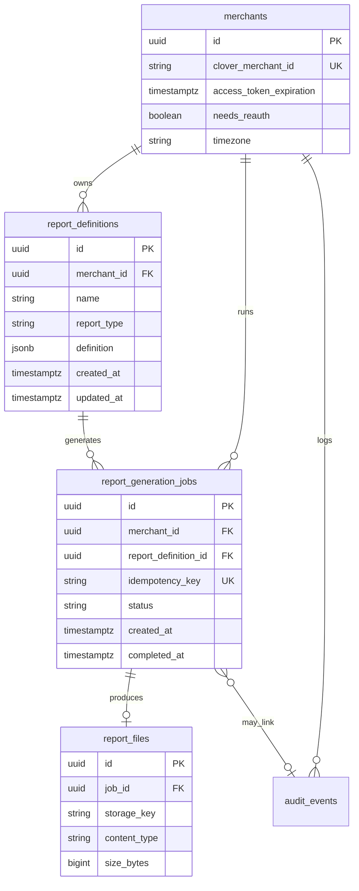

# Sales reporting — ERD sketch (evolving)

**Status:** Draft — starter for relational modeling of **report types**, **categories**, **column catalogs**, and **saved reports**. Expect edits after inventory reporting design and Clover sandbox mapping.

**Related:** [`data-model.md`](data-model.md) (canonical v1 tables: `merchants`, `report_definitions`, `report_generation_jobs`, `report_files`, `audit_events`), [`PRD.md`](PRD.md) §8 & Appendix B, [`sales-report-types-and-data-points.md`](sales-report-types-and-data-points.md).

---

## Design intent

1. **v1 today** stores most wizard state in **`report_definitions.definition`** (JSON). That remains valid.
2. This sketch adds **optional normalization** when we want: stable ids for columns, preset templates, analytics on “which columns merchants pick,” or shared enums across Sales and Inventory.
3. **Report “types”** in the product = **`Sales` | `Inventory`** (v1). **Sales report patterns** (by tender, by employee, …) are **categories/presets**, not separate DB report types unless we add them later.

---

## Existing entities (from `data-model.md`)



---

## Proposed additions (Sales-focused)

### 1. `report_type` enum (optional table)

Small reference: `Sales`, `Inventory` — mirrors `report_definitions.report_type` if we want FK integrity.

```text
report_types
  id           PK  (or code: SALES, INVENTORY)
  code         UK
  display_name
```

---

### 2. `sales_report_category` (documentation / presets)

Groups merchant-facing **patterns** from [`sales-report-types-and-data-points.md`](sales-report-types-and-data-points.md) for UI presets or help text — **not** required for v1 export logic.

```text
sales_report_categories
  id              PK
  slug            UK   -- e.g. by_tender, by_employee, period_kpis
  display_name
  description     -- optional
  sort_order
```

---

### 3. `report_column_option` (normalized column catalog)

One row per selectable **detail** or **summary** option (align keys with Appendix B).

```text
report_column_options
  id                 PK
  report_type_code   FK → report_types.code  -- SALES | INVENTORY
  column_key         UK per report_type      -- stable machine key, e.g. order_id, line_qty
  display_label      -- matches PRD B.3 / B.3.1 user-facing text
  field_group        -- order | line_item | payment | period_summary
  data_type          -- string, money_cents, int, boolean, timestamp, ...
  is_period_summary  boolean default false   -- true for B.3.1 rows
  default_selected   boolean default false
  sort_order
  clover_notes       -- free text until api-column-map exists
```

**Alternative:** Keep catalog in code (`const SALES_COLUMNS = [...]`) and skip this table until we need DB-driven columns.

---

### 4. Preset templates (optional)

Merchants pick “**Sales by tender**” → we pre-fill column keys + suggested filters.

```text
sales_report_presets
  id                   PK
  sales_report_category_id  FK → sales_report_categories
  name                 -- user-facing preset name
  description          -- optional

sales_report_preset_columns
  preset_id            FK
  column_option_id     FK → report_column_options
  PK (preset_id, column_option_id)
```

`report_definitions` can store `preset_id` inside JSON for traceability, or expand preset into `definition` on save (denormalized).

---

### 5. Junction: definition ↔ columns (only if normalizing wizard choices)

If `definition` JSON is split out:

```text
report_definition_columns
  report_definition_id  FK
  column_option_id      FK
  PK (report_definition_id, column_option_id)
```

**Period summary checkboxes** could be rows with `field_group = period_summary` or boolean flags on `report_definition_period_summary`.

```text
report_definition_period_summary
  report_definition_id   FK
  column_option_id       FK  -- only rows where is_period_summary
  enabled                boolean
  PK (report_definition_id, column_option_id)
```

Most v1 implementations will **not** need these junction tables if the JSON blob is the source of truth.

---

## `definition` JSON shape (reminder)

Align with PRD §8 wizard payload, conceptually:

```json
{
  "time_span": { "start": "...", "end": "..." },
  "location_scope": { "mode": "all" },
  "scope_filters": {
    "exclude_test": true,
    "exclude_voided_from_revenue": true,
    "completed_orders_only": true,
    "employee_id": null
  },
  "columns": { "detail": ["order_id", "line_qty"], "period_summary": ["gross_sales", "order_count"] },
  "export_format": "XLSX"
}
```

Exact keys are implementation-defined; **document** them next to Drizzle schema when added.

---

## Inventory (future)

Mirror `report_column_options` rows for Appendix B.4; optional `inventory_report_categories` (e.g. low stock, valuation — TBD). **Do not** merge Sales and Inventory column namespaces without a `report_type_code` discriminator.

---

## What to build first

1. Keep **`report_definitions.definition` JSON** as v1 store.
2. Seed **`report_column_options`** in code or SQL when the wizard is built; promote to DB if ops/product need it.
3. Add **`sales_report_categories` / presets** when UX adds “starter templates.”
4. Revisit this ERD after **`docs/api-column-map.md`** stabilizes Clover JSON paths.
